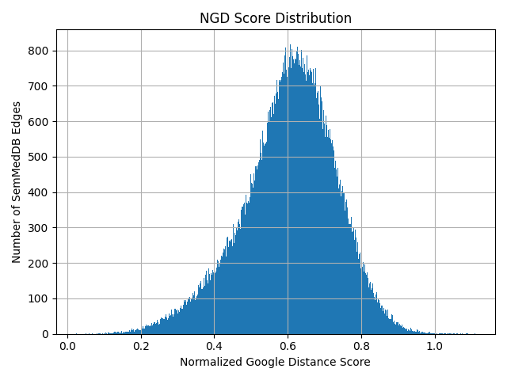
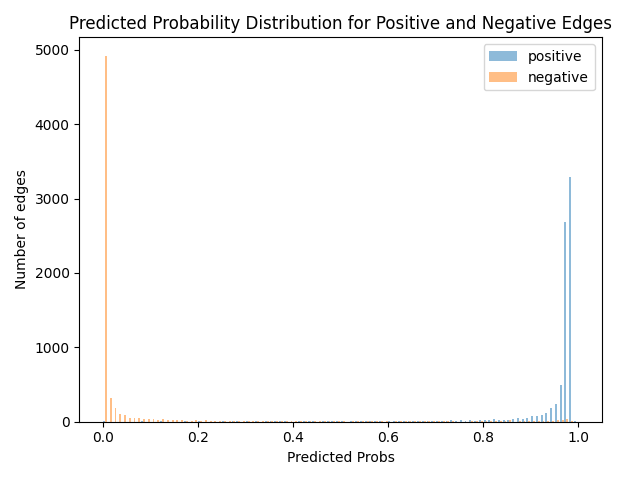
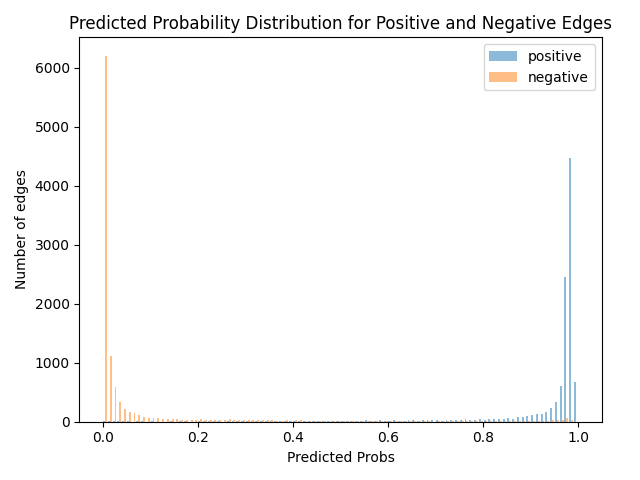

# The Creative Mode for Chemical-Gene Regulation (increase/decrease) Prediction

## Description
To explore the regulation relationship (e.g., increase/decrease) between chemicals and genes, we develop two machine learning models that are now integrated into the [ARAX infer module](https://github.com/RTXteam/RTX/blob/master/code/ARAX/Documentation/DSL_Documentation.md#arax_infer) with action name `chemical_gene_regulation_graph_expansion`. These two models were trained based on the unsupervised GraphSage embeddings and Random Forest model, that is, we used the [GraphSage source code](https://github.com/williamleif/GraphSAGE) to get the embeddings of each node in RTX-KG2.8.0c (after filtering mentioned below), and then use them as the input feature of Rndom Forest model for binary classification (e.g., has the relationship or not). Given a pair of chemical and gene, these models can give a predicted probability of how likely the given chemical can "increase/decrease" the activity or abundance of a given gene. Additionally, for each pair selected by the users based on the model results, we utilize the [ARAX expander](https://github.com/RTXteam/RTX/blob/master/code/ARAX/Documentation/DSL_Documentation.md#arax_expander) module to extract the paths with a given length from RTX-KG2.8.0c for mechanism explanation. 

---
## Training data

All training data are from the existing edges between chemical curies (the curie with category of either `biolink:ChemicalEntity`, `biolink:ChemicalMixture` or `biolink:SmallMolecule`) and gene curies (the curie with category of either `biolink:Gene` or `biolink:Protein`) that have `qualified_object_direction='increased' or qualified_object_direction='decreased'`. 

### 'Increased' Model
We get `95,187` edges between chemical curies and gene curies with 'qualified_object_direction='increased' from KG2.8.0c, of which `94,748 (~99.54%)` are only from the SemMedDB database and the rest edges from other data sources or more than two data sources (including the SemMedDB database). Considering that the triples called by the NLP algorithm used in SemMedDB still have high false positive, we filter out some SemMedDB-based edges using [PubMed-based Normalized Google Distance](https://academic.oup.com/bioinformatics/advance-article/doi/10.1093/bioinformatics/btad082/7031241) with threshold <= 0.6 based on the NGD distribution below:

After filtering, we have `40,429` positive training edges that includes both the filtered SemMedDB-based edges and non-SemMedDB-based edges. For each chemical in the positive training edges, we randomly pick 5 gene curies to pair with this chemical to get the negative training edges (Note that these negative training edges don't overlap with the `40,429` positive training edges.). We applied the same method to the gene curies that are in the positive training edges. 

Finally, we have `40,429` positive training edges and `62,525` negative training edges. These edges are proportionally split into the "training" set and "test" set according to the ratio 8/2, that is, we have `82,363 (Positive:32,343; Negative:50,020)` pairs in the "training" set while `20,591 (Positive:8,086; Negative:12,505)` pairs in the "test" set.

### 'Decreased' Model
We got `112,118` edges between chemical curies and gene curies with 'qualified_object_direction='decreased' from KG2.8.0c, of which `105,573 (~94.16%)` are only from the SemMedDB database and the rest edges from other data sources or more than two data sources (including the SemMedDB database). We used the same filtering method with the same threshold based on the NGD distribution below:

Like the "increasaed" model, we use the same method to split the positive training edges. Thus, we finally have `54,831` positive training edges and `90,100` negative training edges. These edges are proportionally split into the "training" set and "test" set according to the ratio 8/2, that is, we have `115,944 (Positive:43,864; Negative:72,080)` pairs in the "training" set while `28,987 (Positive:10,967; Negative:18,020)` pairs in the "test" set.

---
## Model performance

### 'Increased' Model

|                     | "Training" Accuracy | "Training" F1 Score | "Test" Accuracy | "Test" F1 Score |
|---------------------|---------------------|---------------------|-----------------|-----------------|
| Positive Edges Only | 1.00000             | -                   | 0.98182         | -               |
| Negative Edges Only | 0.97540             | -                   | 0.94507         | -               |
| Combined Edges      | 0.98873             | 0.98862             | 0.96517         | 0.96475         |

#### Predicted Probability Distribution based on test dataset

### 'Decreased' Model

|                     | "Training" Accuracy | "Training" F1 Score | "Test" Accuracy | "Test" F1 Score |
|---------------------|---------------------|---------------------|-----------------|-----------------|
| Positive Edges Only | 0.99742             | -                   | 0.96928         | -               |
| Negative Edges Only | 0.97834             | -                   | 0.94593         | -               |
| Combined Edges      | 0.98802             | 0.98801             | 0.95774         | 0.95772         |

#### Predicted Probability Distribution based on test dataset
