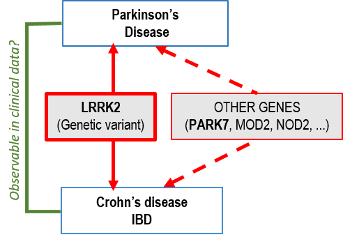
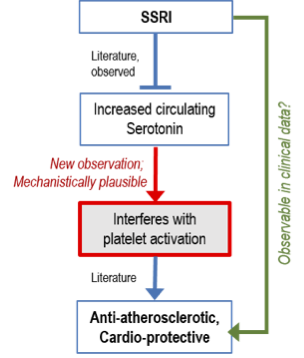
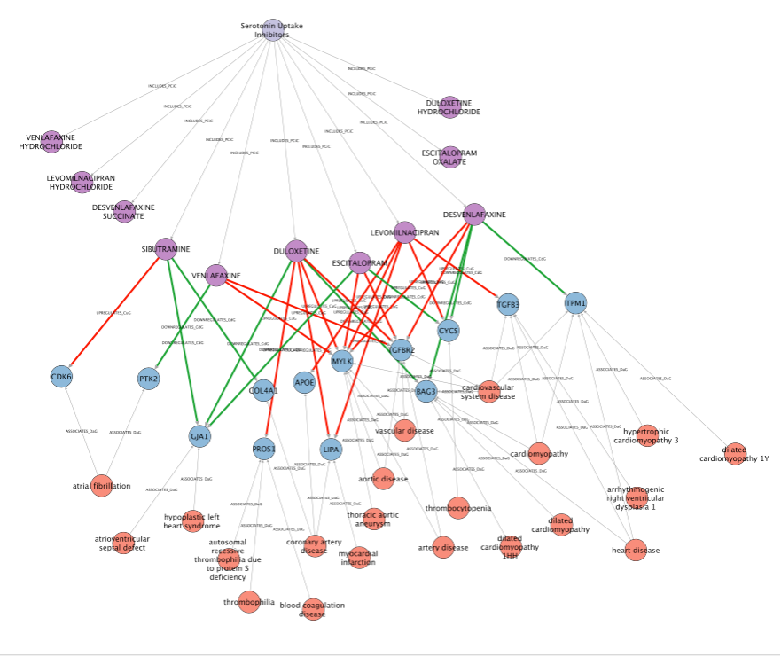
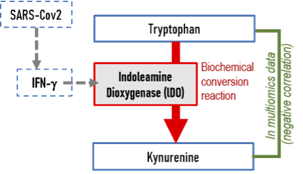
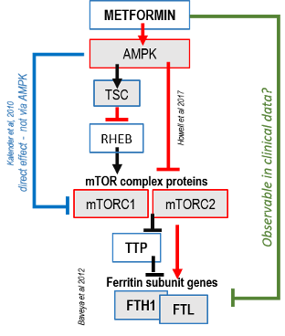

# Workflow D: EXPLAIN
## Purpose
This Workflow D is designed to demonstrate the Translator's ability to
explain a biological phenomenon or observation by filling in missing
pieces of a possible mechanistic causal chain that connect two concepts
(entities) A and B observed to be associated.  This type of question are
on the rise in the era of big data medicine. For instance, why are, as
seen in metabolomics study in a cohort, the metabolites A and B
anti-correlated?  Why do users of drug A, as seen in a big data
analytics of an EHR data set, have a lower risk of disease B?  With the
anticipated spread of multi-omics profiling of patient material in
research and diagnostics, many unexplained associations will emerge
– between drug use, blood metabolites an porteins, clinical
manifestations etc. The goal of a query is to find an explanatory
multi-hop path in a knowledge graph that may help explain the empirical
association between the entities A and B.

Currently, Translator queries assume a particular structure of the
explanation, embodied by the query graph. Then the task of the
Translator is to "fill in the blanks" defined in the query graph. In the
future identifying the best query graph will be part of the task by the Translator)

NOTE: Because a query graph structure is still required even if the user
may not know the struture of the explanatory mechanism they are looking
for, to test the Workflow, the queries were reverse-engineered from
known or possible answers (in the form of knowledge graphs). The latter
were previously designed based on SME knowledge or literature, or
extracted from SPOKE KP via the neighborhood explorer tool that gives
GUI access to the [SPOKE KG](https://spoke.rbvi.ucsf.edu/) – see example
in D.2. The graphs were then encoded as TRAPI JSON but it may need to be
broken down into step-wise queries for a Translator workflow that can
realistically executed at this point since there is no operation yet
for: "connect the dots without specified qgraph structure". 

The four initial queries for a first round of testing (starting July
2021) seek to answer the following questions:

## Queries
### D.1. Why do Crohn's disease patients have a higher risk to develop Parkinson's disease?
**PURPOSE:** Two independently established gene-disease relationships
(one-hop) are joined by the common gene that is involved in both
diseases – explaining why pateints with one disease (Crohn's disease)
are at risk of the other, apparently independent disease (Parkinson's
disease). Can the Translator, starting with the name of these two
diseases, identify the common gene? This question tests a two-hop query
in which the central node is the unknown gene that connects the two
input diseases. 

**BIOLOGY:**

*blue = query input, red = unknown, to be returned*

**ANTICIPATED RETURN:** This example is based on established
"ground truth". Its simple structure makes thus query essentially a
loop-up in the form of an 'AND' search. The return should identify the
gene 'LRRK2' as the genetic basis of both diseases. But other genes
(PARK7, MOD2, NO2,..) have also been associated with both these
diseases.

### D.2 Why do SSRI (a group of anti-depressants) have cardio-protective effect?

**PURPOSE:** This query, like D.1., also seeks one node that in a
two-hop query will connect the two input nodes: a drug (family) and a
disease (group). The challenge is higher than in D.1. since here the
type of the node queries is not defined because the very nature of the
mechanistic explanation is not known. Additional challenges come from
the fact that the nodes contain hierarchical higher-level terms (family
of drugs, group of diseases), requiring down-ward expansion for the
query. Notably, for the bottom node a proper modeling/query for the
ontology of 'heart disease' will be tested. For the top node, similarly
the drug family of 'SSRI' may have be expanded to query specific
compounds of this family. An additional challenge that the mechanism
connecting the drug and the beneficial side-effect may involve more than
one node. The query D.3. offers a simplified query graph.

**BIOLOGY**:

*blue = query input, red = unknown, to be returned*

**ANTICIPATED RETURN:** In this case, for the return there is no simple
ground truth. An empirical study has suggested that akin to the action
of anti-platelet-aggregation drugs, interference with platelet
activation may explain a benefit in reducing the risk for ischemic heart
disease, such as myocardial infarct. Thus, at least one term related to
platelet function that is connected to SSRI (possibly via serotonin) and
to cardiac disease would represent a useful return. But the ground truth
may be complex and other mechanisms are likely involved and must be
evaluated individually by SMEs. For instance, an interactive SPOKE
search retrieved the other genes that may play a role in coronary artery
diseases and myocardial infract and are affected by specific SSRI drugs,
such as 'LIPA', PROS1  or 'TGF-beta' pathway proteins (however, the
directionality with respect to increase/decrease risk of heart disease
remains to be determined). The figure below illustrates as an example of
results obtained when using an interactive approach such as the
Neighborhood Explorer web GUI extract information from the SPOKE KG to
address the question posed in this D.2. query:

Due to this challenge, the query graph was also generated from a simpler
solution involving only one hop (D.3.).

### D.3. The simplified one-hop version of D.2., by searching for specified nodes and unspecified predicates

### D.4. Why are serum kynurenine and tryptophan in COVID-19 patients anti-correlated?

**PURPOSE:** An anti-correlation in the blood levels of two metabolites
of the same pathway could indicate that one is the substrate (upstream)
and the other is the product (downstream) and that in the condition
(patient cohort) in which the anti-correlation has been observed the
conversion of the substrate to product is consistently accelerated. Such
a constellation has been observed for the metabolites Tryptophan and
Kynurenine. We assume here that the user does not know that these two
metabolites form a substrate-product pair of a conversion reaction.
Biochemical reactions have been more of a challenge in data modeling
than regulatory interactions and therefore, this query tests the ability
of the Translator to retrieve reactions using the upstream and
downstream metabolites as query terms. Moreover, enzymatic reactions
typically use hypergraph to represent how an enzyme affects an edge not
a node. Hypergraphs however are not compatible with most biomedical
knowledge graphs, including those used in the Translator. Some KP model
the reaction simply as an edge others as an additional node. Can the
query be robust to such variation in graph structure of KPs that encode
the same content?

**BIOLOGY:** The conversion of Tryptophan to Kynurenine is the reaction
that we look for, and it is catalyzed by the enzyme indolamine
dioxygenase (IDO) which is upregulated by IFN-g in COVID-19 patients.

*blue = query input, red = unknown, to be returned*

**ANTICIPATED RETURN:** The underlying biology is straightforward, the
ground truth is clear and in textbooks: the biochemical conversion of
'tryptophan' to 'kynurenine'. It is expected that either the reaction
(e.g. implemented by some KPs as a node) is retrieved and connected to
the substrate and product (which are the input terms), or the enzyme
that catalyzes said reaction is retrieved. An optional output for future
testing of "overlays" or local query graph expansion, would be to also
retrieve 'IFN-ɣ' as inducer of the 'IDO' gene – an event that links its
elevation to 'COVID19' which causes a rise of serum IFN-ɣ. This would
provide a biologically meaningful answer to the original question
triggered by the observation.

### D.5. Unconstrained alternative TRAPI for D.4., removed

### D.6 A patient has very high ferritin levels and a biotech contact says that metformin may lower ferritin. Can we determine why?

**PURPOSE:** This use case stems from a real patient case. A routine
blood work of a cancer patient revealed extreme high serum ferritin
levels. This finding was not explained since iron metabolism parameters
appeared normal. Hyperferritinemia is a condition known to be associated
with systemic inflammation. However, it is less known but well
documented that ferritin inhibits T-cell function, and the patient was
about to obtain therapeutic T-cell infusion as immunotherapy. Therefore,
clinicians looked into possibilities to lower ferritin levels. A
pharmaceutical company helped by searching in its vast internal database
of drug (side) effects on a variety of clinical and laboratory
parameters ever observed in drug trials. The return suggested that
metformin, a commonly used drug for Type 2 diabetes, can lower ferritin.
We are interested in possible mechanisms.

The challenge here is formidable: we have not any indication about the
nature of the mechanism, i.e. we do not know how many hops the
connecting mechanistic path will contain nor the type of nodes in it.
The mechanism may be a multi-step molecular cascade. Multiple pathways
exist in the literature.

Since ferritin is not actually a protein, but a protein complex, this
query also tests the ability of the Translator to resolve a protein
complex, which are often clinical parameters, into the protein names of
its subunits that are what is listed in the protein databases. 

**BIOLOGY:**

From literature research conducted in the traditional manner of human
knowledge synthesis, we arrive at the following hypothesis for a
possible explanation for why metformin might decrease ferritin protein
levels:

*blue = query input, red = unknown, to be returned*

**ANTICIPATED RETURN:** Given the complex answer, this query will
heavily rely on the reverse engineered query-graph (see introduction),
and may have to be broken down into individual queries for the purposes
of testing the content availability within the Translator. (Hence, this
query will become more a lookup-type query, as in Workflow A, than
knowledge generation). Most likely mechanistic steps involve
protein-protein interactions and gene regulation, extracted from the
literature. The key elements here are the 'mTor' pathway, which is known
to be suppressed by 'metformin' via its target the 'AMPK' protein. 
A less well-known connection is the regulation of the two 'ferritin'
subunit genes, 'FTH1' an 'FTL' by the mTor complex. Thus, this query
also involves the resolving of two protein complexes into its subunits
(or the gene that encodes them). 